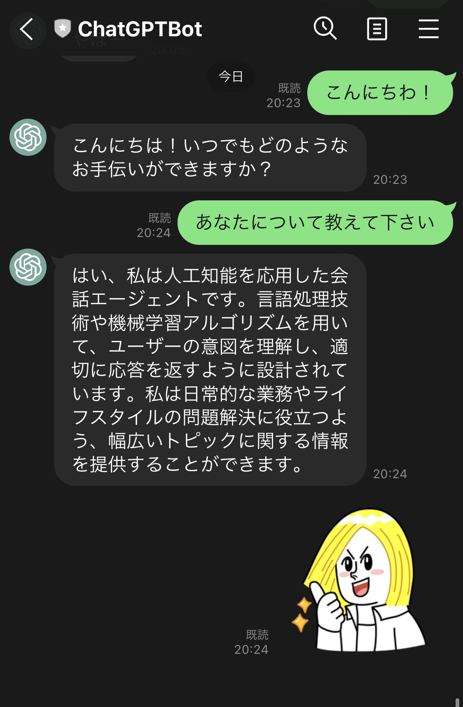

🌙 lambda-linebot-openai
====


## 📗 プロジェクトの概要

LINEから質問すると、ChatGPTが返答してくれるアプリケーションです。
AWS-Lambdaで動作しています。SAMを利用して自動デプロイ可能です。

## 🌐 Demo



## 📦 ディレクトリ構造

```
.
├── README.md
├── app (Lambdaのモジュール)
│   ├── app.js
│   ├── lambda.js
│   ├── local-app.js
│   ├── package-lock.json
│   ├── package.json
│   └── tests
├── layers (共通モジュール)
│   └── app-layer
├── samconfig.toml
└── template.yaml
```

## 🔧 開発環境の構築

IAM ユーザーを用意する
```
ユーザ名：「lambda-user」
アクセス権限：
「AdministratorAccess」
```

SAM CLI をインストールする
```
$ pip install aws-sam-cli
```

AWSにアクセスする為の設定を作成する
```
$ aws configure --profile lambda-user 
AWS Access Key ID [None]: xxxxxxxxxx
AWS Secret Access Key [None]: xxxxxxxxxx
Default region name [None]: ap-northeast-1
Default output format [None]: json
```

LIMEアプリを作成する

https://developers.line.biz/console

Messaging API設定


## 💬 使い方

AWS にデプロイする
```
# ESModuleでビルドできるようにする
$ npm install -g esbuild 
# ビルドを実行する（.aws-samディレクトリに生成される）
$ sam build
# AWSに反映する
$ sam deploy --config-env stg

# AWSから、Lambda&APIGatewayを削除する
$ sam delete --stack-name lambda-linebot-openai --profile lambda-user
```

## 🎨 参考

| プロジェクト| 概要|
| :---------------------------------------| :-------------------------------|
| [【今日から始めるAWS】Lambdaを使ってLINEのbotをつくる](https://qiita.com/theFirstPenguin/items/8168e8ba3d65e34c24e0)| 【今日から始めるAWS】Lambdaを使ってLINEのbotをつくる |


## 🎫 Licence

[MIT](https://github.com/isystk/lambda-linebot-openai/blob/master/LICENSE)

## 👀 Author

[isystk](https://github.com/isystk)
